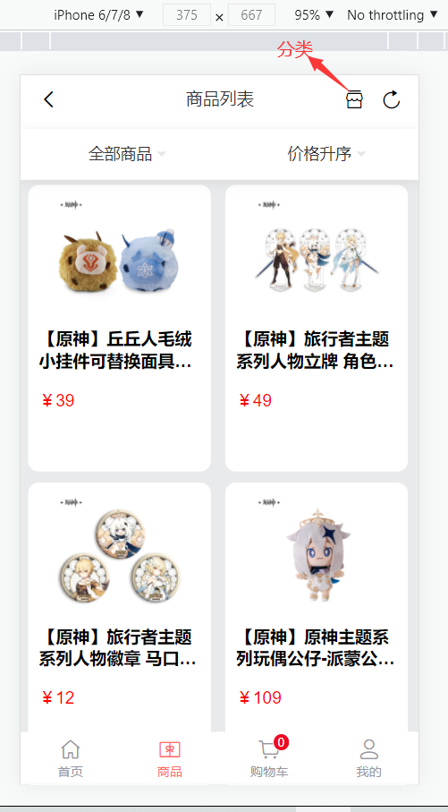

# Vue项目：米游铺

## 团队与分工
* 负责人：xxx，团队成员：xxx，小马 
* 负责模块说明
    * xxx
        1. 前期移动端准备工作（配置路由，完善目录）
        2. 移动端登录注册功能（拦截路由不登录进不了我的，购物车等页面）
        3. 移动端'商品'页面（可按排序，热度，分类显示商品）
        4. 移动端'我的'页面(可修改个人信息，收货地址的增加，修改)
        5. 后台管理系统'用户管理'模块的增删改查,批量删除
        6. 后台管理系统'分类管理'模块增加删除
    * xxx
        1. 准备前期后台管理项目工作（配置路由，完善目录，路由权限）
        2. 移动端'首页'功能完成（点击进入商品详情）
        3. 移动端'购物车'页面（删除，计算总价，增加数量功能写入数据库存储）
        4. 后台管理系统'首页'（显示统计图）
        5. 后台管理系统'订单管理'模块的增删改查
    * 小马
        1. 负责编写后端数据接口 
        2. 移动端'商品详情页面'（可选择商品规格，添加购物车，写进数据库存储）
        3. 移动端'购物车'页面（页面样式）
        4. 后台管理系统'商品管理'模块的增删改查
        5. 项目上线操作，修改合并细节
## 【腾讯文档】接口文档
  * https://docs.qq.com/sheet/DVlBHWFptYVBTVnlz
## 项目页面截图

## 移动端

## 后台管理系统

## 上线后文件目录结构

